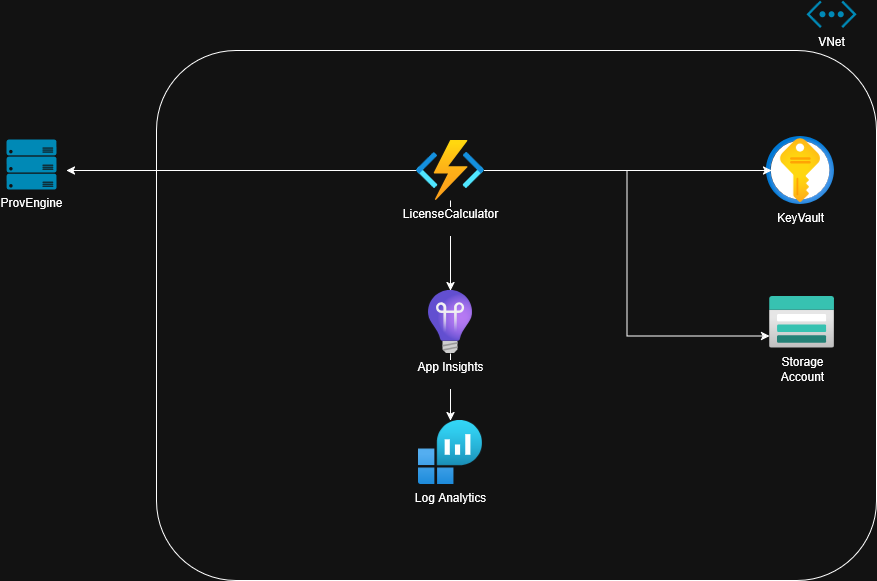

# LicenseCalculator
[](https://azure.microsoft.com/en-us/services/functions/) [](https://dotnet.microsoft.com/en-us/) [](https://fluentvalidation.net/) [](https://github.com/App-vNext/Polly) [](https://xunit.net/) [](https://github.com/moq/moq4)

An Azure Functions application built with .NET 8 that processes license orders by integrating with external license provider APIs. The application features comprehensive validation, error handling, and observability.

[](./docs/diagram.png)

##  Project Structure

```
LicenseCalculator/
├── Functions/                          # Azure Functions endpoints
├── Models/                             # Data models and DTOs
├── Services/                           # Business logic and external API clients
├── Utilities/                          # Cross-cutting concerns
│   ├── Config/                         # Configuration models
│   ├── Exceptions/                     # Custom exceptions
│   ├── Extensions/                     # Extension methods
│   ├── Middleware/                     # Request pipeline middleware
│   ├── Policies/                       # Resilience policies
│   └── Validation/                     # Configuration validation
├── host.json                          # Azure Functions host configuration
└── example.settings.json               # Local development settings
└── Program.cs                          # Entry point for the application
LicenseCalculator.Tests/
├── Functions/                          # Tests for Azure Functions
└── Services/                           # Tests for business logic
```

##  Architecture Overview

### Clean Architecture Layers

1. **Presentation Layer** (`Functions/`)
   - Azure Functions HTTP triggers
   - Request/response handling
   - Input validation coordination

2. **Business Logic Layer** (`Services/`)
   - Order processing orchestration
   - Business rules enforcement
   - External service integration

3. **Infrastructure Layer** (`Utilities/`)
   - HTTP clients
   - Middleware
   - Configuration
   - Cross-cutting concerns

### Key Architectural Patterns

- **Dependency Injection**: Full DI container setup with service registration
- **Options Pattern**: Strongly-typed configuration with validation
- **Middleware Pipeline**: Request correlation and global error handling
- **Repository Pattern**: Abstracted external API access
- **Validation**: FluentValidation with custom rules
- **Resilience**: Polly policies for HTTP retries and timeouts

##  Features

###  Request Processing
- **HTTP Trigger**: `/api/submit-licenses` endpoint
- **Model Binding**: Automatic JSON deserialization with validation
- **Business Logic**: Order validation, company lookup, price calculation
- **External Integration**: License provider API communication

###  Validation & Error Handling
- **Input Validation**: FluentValidation with custom SKU format rules
- **Business Validation**: Company existence, license availability
- **Global Error Handling**: Middleware-based exception handling
- **Structured Responses**: Consistent JSON error responses

### Observability & Monitoring
- **Correlation IDs**: Request tracking across all services and logs
- **Structured Logging**: Scoped logging with automatic correlation
- **Application Insights**: Telemetry and performance monitoring
- **Request/Response Logging**: Comprehensive audit trail

###  Configuration & Security
- **Azure Key Vault**: Production secrets management
- **User Secrets**: Local development configuration
- **Options Validation**: Startup configuration validation
- **Environment-Specific Settings**: Development/production configurations

###  Resilience & Performance
- **Retry Policies**: Automatic retry with exponential backoff
- **Timeout Handling**: Request timeout configuration
- **Parallel Processing**: Concurrent price fetching for multiple SKUs
- **Connection Pooling**: Optimized HTTP client usage

## Technology Stack

- **.NET 8**: Latest .NET version with C# 12 features
- **Azure Functions**: Serverless compute platform
- **FluentValidation**: Powerful validation framework
- **Polly**: Resilience and transient-fault handling
- **Application Insights**: Monitoring and telemetry
- **xUnit**: Unit testing framework
- **Moq**: Mocking framework for tests

##  API Specification

### Submit Licenses Endpoint

**POST** `/api/submit-licenses`

#### Request Body
```json
{
  "country": "Latvia",
  "companyName": "LIDO",
  "orderedLicenses": [
    {
      "sku": "TPLV7893-85",
      "count": 10
    },
    {
      "sku": "TPLV7884-85", 
      "count": 5
    }
  ]
}
```

#### Success Response (200)
```json
{
  "success": true,
  "message": "Order processed successfully for LIDO",
  "data": {
    "companyName": "LIDO",
    "result": "{ external API response }",
    "processedAt": "2024-01-15T10:30:00Z"
  },
  "requestId": "abc12345",
  "timestamp": "2024-01-15T10:30:00Z"
}
```

#### Error Response (400/500)
```json
{
  "success": false,
  "error": "Validation failed: SKU must follow format TPLV####-##",
  "statusCode": 400,
  "requestId": "abc12345",
  "timestamp": "2024-01-15T10:30:00Z"
}
```

##  Configuration

### Required Settings

#### `appsettings.json`
```json
{
  "LicenseProvider": {
    "BaseUrl": "https://api.licenseprovider.com",
    "GetCompaniesPath": "/api/companies",
    "GetCompanyDetailsPath": "/api/company-details",
    "GetPricePath": "/api/pricing",
    "SubmitResultPath": "/api/submit-result",
    "GetCompaniesCode": "COMP001",
    "GetCompanyDetailsCode": "COMPDET001", 
    "GetPriceCode": "PRICE001",
    "SubmitResultCode": "SUBMIT001",
    "DefaultTimeoutSeconds": 30
  }
}
```

### Validation Rules

#### SKU Format
- Pattern: `TPLV####-##` (e.g., `TPLV7893-85`)
- Must start with "TPLV"
- Followed by exactly 4 digits
- Hyphen separator  
- Ending with exactly 2 digits

#### Order Request
- Country: Required, non-empty
- Company Name: Required, non-empty
- Ordered Licenses: At least one license required
- License Count: Must be greater than 0, max 10,000

##  Testing

### Test Structure
```
LicenseCalculator.Tests/
├── Functions/
│   └── SubmitLicensesFunctionTests.cs    # Function endpoint tests
├── Services/
   ├── OrderOrchestratorTests.cs         # Business logic tests  
   └── LicenseProviderClientTests.cs     # HTTP client tests

```

### Test Categories
- **Unit Tests**: Individual component testing with mocking
- **Validation Tests**: Input validation rule verification
- **Error Handling Tests**: Exception scenario coverage

### Running Tests
```bash
dotnet test LicenseCalculator.Tests
```

##  Local Development

### Prerequisites
- .NET 8 SDK
- Azure Functions Core Tools
- Visual Studio 2022 or VS Code with Azure Functions extension

### Setup
1. **Clone repository**
   ```bash
   git clone https://github.com/DimitarGrozev/LicenseCalculator
   cd LicenseCalculator
   ```

2. **Configure local settings**
   ```bash
   cp local.settings.json.template local.settings.json
   # Edit local.settings.json with your configuration
   ```

3. **Install dependencies**
   ```bash
   dotnet restore
   ```

4. **Run locally**
   ```bash
   func start
   ```

5. **Test endpoint**
   ```bash
   curl -X POST http://localhost:7071/api/submit-licenses \
     -H "Content-Type: application/json" \
     -d '{
       "country": "Latvia",
       "companyName": "LIDO", 
       "orderedLicenses": [
         {"sku": "TPLV7893-85", "count": 10}
       ]
     }'
   ```

##  Monitoring & Debugging

### Correlation ID Tracking
Every request gets a unique correlation ID that appears in all logs:
```
[2024-01-15T10:30:00.127Z] Request started [CorrelationId: abc12345]
[2024-01-15T10:30:01.200Z] Processing order for company: LIDO [CorrelationId: abc12345]
```

### Application Insights Queries
```kql
// Find all logs for a specific request
traces
| where customDimensions.CorrelationId == "abc12345"
| order by timestamp asc

// Find failed requests with full trace
traces  
| where customDimensions.CorrelationId in (
    traces 
    | where severityLevel >= 3
    | distinct tostring(customDimensions.CorrelationId)
)
```

